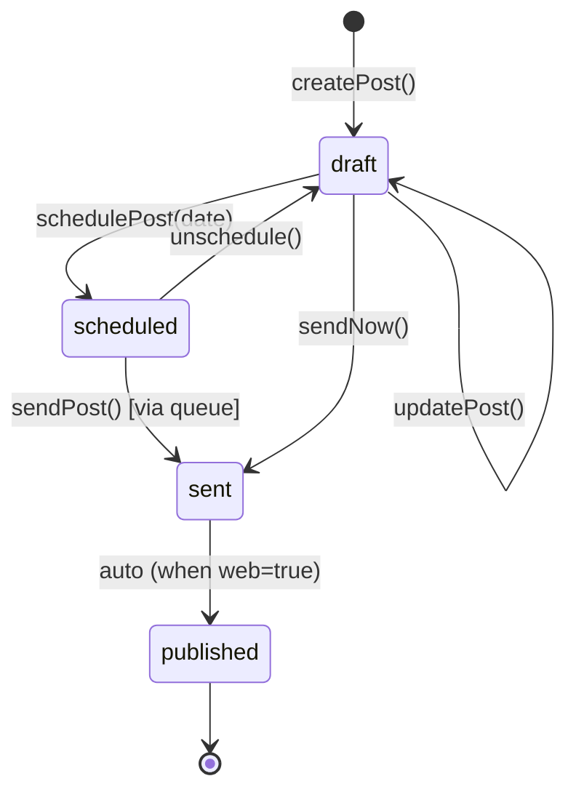
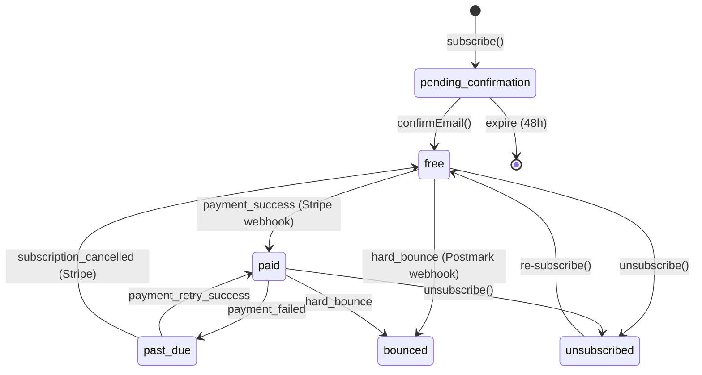

# Pseudocode: Inkflow
**Дата:** 2026-04-23 | **Scope:** Core algorithms, data flow, API contracts

---

## 1. Core Algorithms

### Algorithm: Email Send Pipeline

```
FUNCTION sendPost(postId, authorId):
  INPUT: postId: UUID, authorId: UUID
  OUTPUT: jobId: UUID | Error

  // Validation
  post = DB.findPost(postId, authorId)
  IF post IS NULL: THROW AuthError("Post not found or access denied")
  IF post.status != 'scheduled' AND post.status != 'draft':
    THROW ConflictError("Post already sent")

  publication = DB.findPublication(post.publication_id)

  // Get recipients
  subscribers = DB.findActiveSubscribers(publication.id, {
    tier: post.access == 'paid' ? ['paid'] : ['free', 'paid']
  })
  IF subscribers.length == 0: THROW ValidationError("No subscribers to send to")

  // Render email
  htmlContent = renderEmailTemplate({
    post: post,
    publication: publication,
    unsubscribeUrl: generateUnsubscribeToken()
  })

  // Enqueue batch jobs (max 1000 per batch for Postmark API)
  batches = chunk(subscribers, 1000)
  jobIds = []

  FOR EACH batch IN batches:
    emailSends = []
    FOR EACH subscriber IN batch:
      send = DB.createEmailSend({
        post_id: postId,
        subscriber_id: subscriber.id,
        status: 'queued'
      })
      emailSends.push({ sendId: send.id, to: subscriber.email })

    jobId = EmailQueue.add('send-batch', {
      postId: postId,
      sends: emailSends,
      html: htmlContent,
      subject: post.title,
      fromName: publication.name,
      fromEmail: publication.sending_email
    })
    jobIds.push(jobId)

  // Update post status
  DB.updatePost(postId, { status: 'sent', sent_at: NOW() })

  RETURN { jobIds, recipientCount: subscribers.length }


WORKER sendBatchWorker(job):
  INPUT: job.data { postId, sends, html, subject, fromName, fromEmail }

  results = Postmark.sendBatch(sends.map(s => ({
    To: s.to,
    From: `${fromName} <${fromEmail}>`,
    Subject: subject,
    HtmlBody: html.replace('{{UNSUBSCRIBE_TOKEN}}', generateToken(s.sendId)),
    TrackOpens: true,
    TrackLinks: 'HtmlAndText',
    MessageStream: 'outbound'
  })))

  FOR EACH result IN results:
    sendId = sends.find(s => s.to == result.To).sendId
    IF result.ErrorCode == 0:
      DB.updateEmailSend(sendId, { status: 'sent', message_id: result.MessageID })
    ELSE:
      DB.updateEmailSend(sendId, { status: 'failed' })
      LOG.error({ sendId, error: result.Message })

  COMPLEXITY: O(n) where n = batch size (max 1000)
  RETRY: 5 times with exponential backoff (1s, 2s, 4s, 8s, 16s)
```

---

### Algorithm: Stripe Webhook Handler

```
FUNCTION handleStripeWebhook(rawBody, signatureHeader):
  INPUT: rawBody: Buffer, signatureHeader: string
  OUTPUT: void | Error

  // Verify signature
  event = Stripe.constructEvent(rawBody, signatureHeader, STRIPE_WEBHOOK_SECRET)
  IF verification fails: THROW 400 "Invalid signature"

  SWITCH event.type:

    CASE 'checkout.session.completed':
      session = event.data.object
      subscriber = DB.findSubscriberByEmail(
        session.customer_email,
        session.metadata.publication_id
      )
      DB.updateSubscriber(subscriber.id, {
        tier: 'paid',
        stripe_subscription_id: session.subscription,
        stripe_customer_id: session.customer
      })
      EmailService.sendWelcomePaidEmail(subscriber)

    CASE 'invoice.payment_failed':
      subscription = DB.findSubscriberByStripeSubId(event.data.object.subscription)
      DB.updateSubscriber(subscription.id, { tier: 'past_due' })
      EmailService.sendPaymentFailedEmail(subscription)
      SCHEDULE retry in 3 days

    CASE 'customer.subscription.deleted':
      subscription = DB.findSubscriberByStripeSubId(event.data.object.id)
      DB.updateSubscriber(subscription.id, { tier: 'free' })
      EmailService.sendSubscriptionCancelledEmail(subscription)

    DEFAULT:
      LOG.info({ event: event.type, message: "Unhandled event type" })

  RETURN { received: true }
```

---

### Algorithm: SEO Metadata Generator

```
FUNCTION generateSEOMetadata(post, publication):
  INPUT: post: Post, publication: Publication
  OUTPUT: SEOMetadata object

  // Title: custom > post title + publication name
  title = post.seo_title OR `${post.title} | ${publication.name}`
  IF title.length > 60: title = title.substring(0, 57) + '...'

  // Description: custom > excerpt > first 160 chars of content (stripped)
  rawText = stripHTML(post.content_html)
  description = post.seo_description
    OR post.excerpt
    OR rawText.substring(0, 157) + '...'

  // Canonical URL
  canonicalUrl = publication.custom_domain
    ? `https://${publication.custom_domain}/posts/${post.slug}`
    : `https://${publication.slug}.inkflow.io/posts/${post.slug}`

  // Open Graph image
  ogImage = post.cover_image_url
    OR publication.avatar_url
    OR DEFAULT_OG_IMAGE

  RETURN {
    title: title,
    description: description,
    canonical: canonicalUrl,
    og: {
      title: title,
      description: description,
      image: ogImage,
      type: 'article',
      publishedTime: post.sent_at,
      author: publication.name
    },
    twitter: {
      card: 'summary_large_image',
      title: title,
      description: description,
      image: ogImage
    },
    structuredData: {
      "@context": "https://schema.org",
      "@type": "Article",
      "headline": post.title,
      "datePublished": post.sent_at,
      "author": { "@type": "Person", "name": publication.name },
      "publisher": { "@type": "Organization", "name": "Inkflow" }
    }
  }
```

---

### Algorithm: Substack Import Parser

```
FUNCTION parseSubstackExport(zipBuffer, publicationId):
  INPUT: zipBuffer: Buffer, publicationId: UUID
  OUTPUT: ImportResult { imported: number, failed: number, errors: string[] }

  // Extract ZIP
  files = unzip(zipBuffer)
  csvFile = files.find(f => f.name == 'subscribers.csv')
  IF csvFile IS NULL: THROW ValidationError("subscribers.csv not found in ZIP")

  // Parse CSV
  rows = parseCSV(csvFile.content, {
    columns: true,
    skip_empty_lines: true
  })

  valid = []
  errors = []

  FOR EACH row IN rows:
    email = row.email?.trim().toLowerCase()
    IF NOT isValidEmail(email):
      errors.push(`Invalid email: ${row.email}`)
      CONTINUE

    valid.push({
      publication_id: publicationId,
      email: email,
      tier: row.type == 'paid' ? 'paid' : 'free',
      subscribed_at: parseDate(row.created_at) OR NOW()
    })

  // Upsert (ignore duplicates)
  result = DB.upsertSubscribers(valid, {
    conflictTarget: ['publication_id', 'email'],
    onConflict: 'DO NOTHING'
  })

  RETURN {
    imported: result.rowCount,
    failed: errors.length,
    errors: errors.slice(0, 50)  // cap error list for response
  }

  COMPLEXITY: O(n log n) where n = subscriber count
```

---

### Algorithm: AI Draft Generation

```
ASYNC FUNCTION generateDraft(topic, publicationId, authorId):
  INPUT: topic: string, publicationId: UUID, authorId: UUID
  OUTPUT: draft: string | Error

  // Validate
  IF topic.length < 5: THROW ValidationError("Topic too short")
  IF topic.length > 500: THROW ValidationError("Topic too long")

  // Rate limit: 10 AI calls per author per hour
  key = `ai_ratelimit:${authorId}`
  count = Redis.incr(key)
  IF count == 1: Redis.expire(key, 3600)
  IF count > 10: THROW RateLimitError("AI usage limit reached (10/hour)")

  // Get publication context for personalization
  publication = DB.findPublication(publicationId)
  recentPosts = DB.findRecentPosts(publicationId, { limit: 3, status: 'sent' })

  // Build prompt
  systemPrompt = `You are a professional newsletter writer helping ${publication.name}.
    Write in a clear, engaging, conversational style.
    Target length: 600-800 words.
    Format: Use headers (##), short paragraphs, occasional bullet points.
    DO NOT use generic AI phrases like "In conclusion" or "It's worth noting".`

  userPrompt = `Write a newsletter post about: "${topic}"
    ${recentPosts.length > 0 ? `\nContext from recent posts: ${recentPosts.map(p => p.title).join(', ')}` : ''}`

  // Call Claude API (via MCP)
  response = await Claude.messages.create({
    model: 'claude-sonnet-4-6',
    max_tokens: 1500,
    system: systemPrompt,
    messages: [{ role: 'user', content: userPrompt }]
  })

  draft = response.content[0].text

  // Audit log
  DB.createAILog({ authorId, publicationId, topic, tokens: response.usage.output_tokens })

  RETURN draft

  ERROR HANDLING:
  IF Claude API timeout (> 30s): THROW ServiceUnavailableError
  IF Claude API 429: THROW RateLimitError with retry-after header
```

---

## 2. State Transitions

### Post Lifecycle



### Subscriber Lifecycle



---

## 3. Data Flow

### Email Send Flow

```
Author clicks "Send Now"
        |
        v
POST /api/posts/:id/send
        |
   [Validation]
        |
        v
   DB: get subscribers
        |
        v
   DB: create EmailSend records (status=queued)
        |
        v
   BullMQ: enqueue batch jobs
        |
        v
   DB: update post status → 'sent'
        |
        v
   Response: { jobIds, recipientCount }

Meanwhile (async):
BullMQ Worker picks up batch job
        |
        v
   Postmark API: sendEmailBatch()
        |
        v
   DB: update EmailSend status (sent/failed)
        |
        v
   [Later] Postmark Webhook → /api/webhooks/postmark
        |
        v
   DB: create EmailEvent (open/click/bounce)
```

### Subscription Payment Flow

```
Reader clicks "Subscribe ($8/month)"
        |
        v
POST /api/publications/:id/checkout
        |
        v
   Stripe: create CheckoutSession
        |
        v
   Redirect → Stripe Checkout UI
        |
        v
   Reader enters card → Stripe processes
        |
        v
   Stripe Webhook → POST /api/stripe/webhook
   event: checkout.session.completed
        |
        v
   DB: update Subscriber tier → 'paid'
        |
        v
   Email: send welcome-paid email via Postmark
```

---

## 4. Error Handling Strategy

```
ERROR CATEGORIES:

1. VALIDATION (400)
   → Input invalid, missing required fields
   → Response: { error: { code: 'VALIDATION', fields: [...] } }
   → Log: DEBUG level

2. AUTH (401/403)
   → Invalid/expired token, insufficient permissions
   → Response: { error: { code: 'UNAUTHORIZED' | 'FORBIDDEN' } }
   → Log: INFO level

3. NOT_FOUND (404)
   → Resource doesn't exist or belongs to another user
   → Response: { error: { code: 'NOT_FOUND' } }
   → Log: DEBUG level

4. RATE_LIMIT (429)
   → Too many requests
   → Response: { error: { code: 'RATE_LIMIT', retryAfter: seconds } }
   → Log: WARN level

5. EXTERNAL_SERVICE (503)
   → Stripe/Postmark/Claude API unavailable
   → Response: { error: { code: 'SERVICE_UNAVAILABLE' } }
   → Log: ERROR level + alert

6. INTERNAL (500)
   → Unexpected server error
   → Response: { error: { code: 'INTERNAL_ERROR', requestId: '...' } }
   → Log: ERROR level + alert + Sentry capture

GLOBAL RULE: Never expose stack traces or DB errors to clients.
All errors include requestId for log correlation.
```

---

## 5. Additional Algorithms (US-03, US-04, US-07, US-08)

### Algorithm: Autosave Draft (US-03)

```
// Client-side: fires every 30 seconds while editor is open
FUNCTION autosaveClient(postId, content):
  IF content == lastSavedContent: RETURN  // No change, skip
  IF isSaving: RETURN                      // Debounce in-flight requests

  isSaving = true
  showIndicator('Saving...')

  TRY:
    await PATCH /api/posts/{postId} { content_html: content }
    lastSavedContent = content
    lastSavedAt = NOW()
    showIndicator(`Saved ${formatTimeAgo(lastSavedAt)}`)
  CATCH error:
    showIndicator('Save failed — retrying...')
  FINALLY:
    isSaving = false

  // Update indicator every second
  setInterval(() => showIndicator(`Saved ${formatTimeAgo(lastSavedAt)}`), 1000)


// Server-side: PATCH /api/posts/:id handler
FUNCTION updatePost(postId, authorId, data):
  INPUT: postId: UUID, authorId: UUID, data: { content_html?, title?, excerpt? }
  OUTPUT: Post | Error

  post = DB.findPost(postId, authorId)
  IF post IS NULL: THROW NotFoundError
  IF post.status == 'sent': THROW ConflictError("Cannot edit a sent post")

  updated = DB.updatePost(postId, {
    ...data,
    updated_at: NOW()
  })

  RETURN updated

  COMPLEXITY: O(1)
```

---

### Algorithm: Subscribe / Confirm / Unsubscribe (US-04)

```
FUNCTION subscribe(email, publicationId):
  INPUT: email: string, publicationId: UUID
  OUTPUT: { message: string } | Error

  email = email.trim().toLowerCase()
  IF NOT isValidEmail(email): THROW ValidationError("Invalid email")

  publication = DB.findPublication(publicationId)
  IF publication IS NULL: THROW NotFoundError

  // Idempotent: check existing
  existing = DB.findSubscriber(publicationId, email)
  IF existing AND existing.status == 'active':
    RETURN { message: "You're already subscribed!" }
  IF existing AND existing.status == 'pending_confirmation':
    // Resend confirmation email (idempotent)
    EmailService.sendConfirmationEmail(existing)
    RETURN { message: "Confirmation email resent" }

  // Create or re-activate
  token = generateSecureToken()  // crypto.randomBytes(32).toString('hex')
  subscriber = DB.upsertSubscriber({
    publication_id: publicationId,
    email: email,
    status: 'pending_confirmation',
    confirmation_token: token,
    confirmation_token_expires_at: NOW() + 48h,
    subscribed_at: NOW()
  }, { conflictTarget: ['publication_id', 'email'] })

  EmailService.sendConfirmationEmail({
    to: email,
    publicationName: publication.name,
    confirmUrl: `https://inkflow.io/confirm?token=${token}`
  })

  RETURN { message: "Check your email to confirm subscription" }


FUNCTION confirmSubscription(token):
  INPUT: token: string
  OUTPUT: { publication: Publication } | Error

  subscriber = DB.findSubscriberByToken(token)
  IF subscriber IS NULL: THROW NotFoundError("Invalid confirmation link")
  IF subscriber.confirmation_token_expires_at < NOW():
    THROW GoneError("Confirmation link expired")
  IF subscriber.status == 'active':
    RETURN { publication: DB.findPublication(subscriber.publication_id) }  // Already confirmed, idempotent

  DB.updateSubscriber(subscriber.id, {
    status: 'active',
    confirmation_token: NULL,
    confirmation_token_expires_at: NULL
  })

  RETURN { publication: DB.findPublication(subscriber.publication_id) }

  // Cleanup job: purge pending_confirmation older than 48h
  // Runs via BullMQ cron: '0 * * * *' (hourly)
  CRON cleanExpiredPendingSubscribers():
    DB.deleteSubscribers({
      status: 'pending_confirmation',
      confirmation_token_expires_at: { lt: NOW() }
    })


FUNCTION unsubscribe(token):
  INPUT: token: string (opaque, derived from sendId)
  OUTPUT: { message: string } | Error

  sendId = verifyUnsubscribeToken(token)  // HMAC-verify, extract sendId
  IF sendId IS NULL: THROW ValidationError("Invalid unsubscribe link")

  send = DB.findEmailSend(sendId)
  IF send IS NULL: THROW NotFoundError

  DB.updateSubscriber(send.subscriber_id, {
    status: 'unsubscribed'
  })

  // Immediate effect: < 60 seconds guaranteed by synchronous DB update
  EmailService.sendUnsubscribeConfirmation(send.subscriber_id)

  RETURN { message: "You've been unsubscribed" }

  COMPLEXITY: O(1) for each operation
```

---

### Algorithm: Postmark Webhook Handler (US-08)

```
FUNCTION handlePostmarkWebhook(payload, signatureHeader):
  INPUT: payload: PostmarkWebhookPayload, signatureHeader: string
  OUTPUT: void | Error

  // Verify signature (Postmark uses shared secret in header)
  IF signatureHeader != POSTMARK_WEBHOOK_TOKEN:
    THROW 401 "Invalid webhook signature"

  SWITCH payload.RecordType:

    CASE 'Open':
      send = DB.findEmailSendByMessageId(payload.MessageID)
      IF send IS NULL: LOG.warn('Unknown MessageID'); RETURN

      DB.createEmailEvent({
        email_send_id: send.id,
        event_type: 'open',
        occurred_at: parseDate(payload.ReceivedAt),
        metadata: {
          userAgent: payload.UserAgent,
          client: payload.Client?.Name,
          os: payload.OS?.Name
        }
      })
      DB.updateEmailSend(send.id, { status: 'delivered' })

    CASE 'Click':
      send = DB.findEmailSendByMessageId(payload.MessageID)
      IF send IS NULL: LOG.warn('Unknown MessageID'); RETURN

      DB.createEmailEvent({
        email_send_id: send.id,
        event_type: 'click',
        occurred_at: parseDate(payload.ReceivedAt),
        metadata: { url: payload.OriginalLink }
      })

    CASE 'Bounce':
      send = DB.findEmailSendByMessageId(payload.MessageID)
      IF send IS NULL: LOG.warn('Unknown MessageID'); RETURN

      DB.updateEmailSend(send.id, { status: 'bounced' })
      DB.createEmailEvent({
        email_send_id: send.id,
        event_type: 'bounce',
        occurred_at: parseDate(payload.BouncedAt),
        metadata: { type: payload.Type, description: payload.Description }
      })

      // Hard bounce → mark subscriber bounced
      IF payload.Type IN ['HardBounce', 'SpamComplaint']:
        DB.updateSubscriber(send.subscriber_id, { status: 'bounced' })

    CASE 'Delivery':
      send = DB.findEmailSendByMessageId(payload.MessageID)
      IF send: DB.updateEmailSend(send.id, { status: 'delivered' })

    DEFAULT:
      LOG.info({ type: payload.RecordType, msg: "Unhandled Postmark event" })

  RETURN { received: true }


FUNCTION aggregatePostAnalytics(postId, authorId):
  INPUT: postId: UUID, authorId: UUID
  OUTPUT: PostAnalytics | Error

  post = DB.findPost(postId, authorId)
  IF post IS NULL: THROW NotFoundError

  // Aggregate from EmailSend + EmailEvent tables
  stats = DB.query(`
    SELECT
      COUNT(DISTINCT es.id) AS total_sent,
      COUNT(DISTINCT es.id) FILTER (WHERE es.status = 'delivered') AS delivered,
      COUNT(DISTINCT ee_open.email_send_id) AS unique_opens,
      COUNT(ee_open.id) AS total_opens,
      COUNT(DISTINCT ee_click.email_send_id) AS unique_clicks,
      COUNT(DISTINCT es.id) FILTER (WHERE es.status = 'bounced') AS bounced
    FROM email_sends es
    LEFT JOIN email_events ee_open
      ON ee_open.email_send_id = es.id AND ee_open.event_type = 'open'
    LEFT JOIN email_events ee_click
      ON ee_click.email_send_id = es.id AND ee_click.event_type = 'click'
    WHERE es.post_id = $postId
  `)

  // Time-series: opens per hour over 24h
  timeSeries = DB.query(`
    SELECT
      date_trunc('hour', occurred_at) AS hour,
      COUNT(*) AS opens
    FROM email_events ee
    JOIN email_sends es ON es.id = ee.email_send_id
    WHERE es.post_id = $postId
      AND ee.event_type = 'open'
      AND ee.occurred_at > NOW() - INTERVAL '24 hours'
    GROUP BY 1
    ORDER BY 1
  `)

  RETURN {
    totalSent: stats.total_sent,
    delivered: stats.delivered,
    openRate: stats.unique_opens / stats.total_sent,
    uniqueOpens: stats.unique_opens,
    totalOpens: stats.total_opens,
    clickRate: stats.unique_clicks / stats.total_sent,
    uniqueClicks: stats.unique_clicks,
    bounced: stats.bounced,
    openTimeSeries: timeSeries
  }

  COMPLEXITY: O(n) where n = email_sends for this post; cached for 5 minutes in Redis
```

---

### Algorithm: Paywall Access Control (US-07)

```
FUNCTION checkPostAccess(postId, requestContext):
  INPUT: postId: UUID, requestContext: { userId?: UUID, sessionToken?: string }
  OUTPUT: { allowed: boolean, truncatedAt?: number }

  post = DB.findPostPublic(postId)  // Does not require auth
  IF post IS NULL: THROW NotFoundError
  IF post.access == 'free': RETURN { allowed: true }

  // Paid post: check authentication
  IF NOT requestContext.sessionToken:
    RETURN { allowed: false, truncatedAt: calculateTruncationPoint(post.content_html, 0.20) }

  userId = verifyJWT(requestContext.sessionToken)
  IF NOT userId:
    RETURN { allowed: false, truncatedAt: calculateTruncationPoint(post.content_html, 0.20) }

  // Check subscriber tier for this publication
  subscriber = DB.findSubscriber(post.publication_id, userId)  // by user's email
  IF subscriber AND subscriber.tier == 'paid' AND subscriber.status == 'active':
    RETURN { allowed: true }

  // Free or past_due subscriber
  RETURN { allowed: false, truncatedAt: calculateTruncationPoint(post.content_html, 0.20) }


FUNCTION calculateTruncationPoint(htmlContent, fraction):
  INPUT: htmlContent: string, fraction: float (0.20 = 20%)
  OUTPUT: characterOffset: number

  plainText = stripHTML(htmlContent)
  truncateAt = Math.floor(plainText.length * fraction)

  // Find the nearest paragraph boundary to avoid cutting mid-sentence
  nearestParagraph = htmlContent.lastIndexOf('</p>', truncateAt * 1.5)
  RETURN nearestParagraph > 0 ? nearestParagraph + 4 : truncateAt


// API layer enforces this — content is truncated SERVER-SIDE before sending to client
// Frontend paywall overlay is supplementary, not the security boundary
FUNCTION getPostContent(postId, requestContext):
  access = checkPostAccess(postId, requestContext)
  post = DB.findPostPublic(postId)

  IF access.allowed:
    RETURN { post, truncated: false }
  ELSE:
    truncatedHtml = post.content_html.substring(0, access.truncatedAt)
    RETURN { post: { ...post, content_html: truncatedHtml }, truncated: true }

  COMPLEXITY: O(1) DB lookups; O(n) string truncation where n = content length
```
