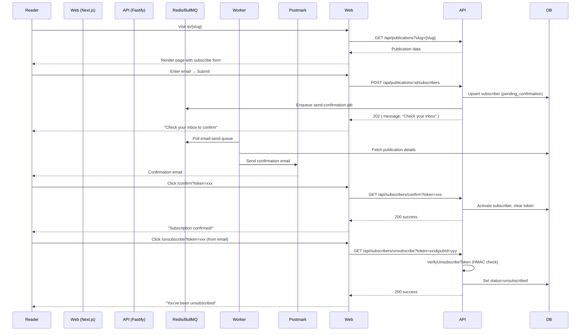

# Architecture: Subscriber Management
**Feature:** F2 | **Date:** 2026-05-01

---

## Architecture Style

Extends the existing Distributed Monolith. Subscriber Management spans three layers:
1. **API** (`apps/api`) — REST endpoints, business logic
2. **Worker** (`apps/worker`) — async email delivery via BullMQ
3. **Web** (`apps/web`) — public subscribe form, confirm/unsubscribe pages, author dashboard

---

## High-Level Flow



---

## Component Breakdown

### apps/api (existing routes)

| File | Status | Notes |
|------|--------|-------|
| `routes/subscribers.ts` | ✅ Exists | Subscribe, confirm, unsubscribe, list endpoints |
| `lib/unsubscribe-token.ts` | ✅ Exists | HMAC token generation/verification |
| **Fix needed** | ⚠️ | Unsubscribe route uses `confirmation_token` lookup instead of `verifyUnsubscribeToken` |

### apps/worker (gaps)

| File | Status | Notes |
|------|--------|-------|
| `workers/email-send.worker.ts` | ✅ Exists | Handles `email:send-batch` queue for post sends |
| `workers/email-confirmation.worker.ts` | ❌ Missing | Needs creation: handles `send-confirmation` jobs on `email-send` queue |
| `workers/index.ts` | ⚠️ Needs update | Register confirmation worker |

**Queue name clarification:**
- Route enqueues to `QUEUE_NAMES.EMAIL_SEND = 'email-send'`
- `email-send.worker.ts` listens on `'email:send-batch'` — different queue
- Solution: Separate confirmation worker on `'email-send'` queue

### apps/web (gaps)

| File | Status | Notes |
|------|--------|-------|
| `app/(public)/p/[slug]/page.tsx` | ❌ Missing | Publication page with subscribe form |
| `app/(public)/confirm/page.tsx` | ❌ Missing | Confirmation landing page |
| `app/(public)/unsubscribe/page.tsx` | ❌ Missing | Unsubscribe landing page |
| `app/(dashboard)/dashboard/subscribers/page.tsx` | ✅ Exists | Author subscriber list |

---

## Data Architecture

Uses existing `Subscriber` table (no new migrations needed):

```
publications (1) ──< subscribers (N)
  id                id
  name              publication_id (FK)
  slug              email
                    name?
                    status (pending_confirmation|active|unsubscribed|bounced|spam)
                    tier (free|paid|trial|past_due)
                    confirmation_token (nullable, 48h TTL)
                    confirmation_token_expires_at
                    confirmed_at
                    unsubscribed_at
```

Index coverage (existing):
- `(publication_id)` — list queries
- `(email)` — lookup
- `(status)` — filtering active subscribers for sends
- `(confirmation_token)` — O(1) token lookup

---

## Security Architecture

| Concern | Implementation |
|---------|---------------|
| Confirmation token | `crypto.randomBytes(32).hex()` — 256-bit entropy |
| Token expiry | 48 hours, checked server-side before activating |
| Single-use | Token cleared (set to NULL) immediately on use |
| Unsubscribe token | HMAC-SHA256(secret, email) — constant-time comparison |
| No PII in URL | HMAC token encodes email; confirmation token is random |
| Queue reliability | BullMQ retries 5×, exponential backoff |

---

## Technology Stack

| Layer | Technology | Why |
|-------|-----------|-----|
| API | Fastify + Zod | Already in use; Zod validates email format |
| Queue | BullMQ on Redis | Async delivery, retries, persistence |
| Email | Postmark + React Email | Deliverability; template already exists |
| Frontend | Next.js 15 App Router | SSR confirm/unsubscribe pages |
| DB | PostgreSQL 16 via Prisma | Existing; upsert handles idempotency |
