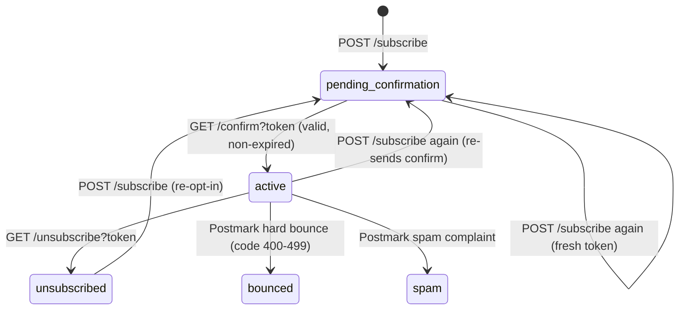

# Pseudocode: Subscriber Management
**Feature:** F2 | **Date:** 2026-05-01

---

## Core Algorithms

### Algorithm: subscribe()

```
FUNCTION subscribe(pubId: UUID, email: string, name?: string):
  INPUT: pubId: UUID, email: string, name?: string
  OUTPUT: { message: string } | Error

  // 1. Validate publication exists
  pub = DB.findPublicationById(pubId)
  IF pub IS NULL: THROW 404 "Publication not found"

  // 2. Check if already active subscriber — do not reset status
  existing = DB.findSubscriber({ publication_id: pubId, email })
  IF existing AND existing.status == 'active':
    // Re-send confirmation to avoid user confusion; do not downgrade to pending
    sendConfirmationEmail(existing, pub)
    RETURN { message: "Confirmation email sent" }

  // 3. Generate token
  token = crypto.randomBytes(32).hex()
  expiresAt = NOW() + 48h

  // 4. Upsert — creates or resets pending subscriber
  subscriber = DB.upsert(Subscriber, {
    where: { publication_id_email: { publication_id: pubId, email } },
    update: {
      name: name ?? keep existing,
      confirmation_token: token,
      confirmation_token_expires_at: expiresAt,
      status: 'pending_confirmation'
    },
    create: {
      publication_id: pubId, email, name, status: 'pending_confirmation',
      tier: 'free', confirmation_token: token,
      confirmation_token_expires_at: expiresAt
    }
  })

  // 5. Enqueue confirmation email via BullMQ
  EmailQueue('email-send').add('send-confirmation', {
    subscriberId: subscriber.id,
    publicationId: pubId,
    email, name,
    confirmationToken: token
  }, { attempts: 5, backoff: { type: 'exponential', delay: 1000 } })

  RETURN { message: "Confirmation email sent. Check your inbox." }
```

---

### Algorithm: confirmSubscription()

```
FUNCTION confirmSubscription(token: string):
  INPUT: token: string
  OUTPUT: { message: string } | Error

  // 1. Find subscriber by token
  subscriber = DB.findSubscriber({ confirmation_token: token })
  IF subscriber IS NULL: THROW 400 "INVALID_TOKEN"

  // 2. Check expiry
  IF subscriber.confirmation_token_expires_at < NOW():
    THROW 400 "TOKEN_EXPIRED"

  // 3. Activate — clear token (single-use)
  DB.update(Subscriber, subscriber.id, {
    status: 'active',
    confirmed_at: NOW(),
    confirmation_token: NULL,
    confirmation_token_expires_at: NULL
  })

  RETURN { message: "Subscription confirmed. Welcome aboard!" }
```

---

### Algorithm: unsubscribe()

```
FUNCTION unsubscribe(token: string, publicationId: string):
  INPUT: token: string (HMAC-signed), publicationId: string
  OUTPUT: { message: string } | Error

  // 1. Verify HMAC token → get email
  email = verifyUnsubscribeToken(token)  // throws if invalid
  IF throws: THROW 400 "INVALID_TOKEN"

  // 2. Find subscriber
  subscriber = DB.findSubscriber({ publication_id: publicationId, email })
  IF subscriber IS NULL: THROW 400 "INVALID_TOKEN"

  // 3. Idempotent: already unsubscribed
  IF subscriber.status == 'unsubscribed':
    RETURN { message: "You are already unsubscribed." }

  // 4. Update status
  DB.update(Subscriber, subscriber.id, {
    status: 'unsubscribed',
    unsubscribed_at: NOW()
  })

  RETURN { message: "You have been successfully unsubscribed." }
```

---

### Algorithm: sendConfirmationEmailWorker()

```
WORKER sendConfirmationEmailWorker(job):
  INPUT: job.data: ConfirmationEmailJob {
    subscriberId, publicationId, email, name, confirmationToken
  }

  // 1. Fetch publication details
  pub = DB.findPublication(publicationId, { include: author })
  IF pub IS NULL: LOG warn "Publication not found, skipping"; RETURN

  // 2. Build confirmation URL
  confirmUrl = `${APP_URL}/confirm?token=${confirmationToken}`

  // 3. Render email template (ConfirmationEmail React Email)
  html = render(<ConfirmationEmail
    publicationName={pub.name}
    confirmationUrl={confirmUrl}
    authorName={pub.author.name}
  />)

  // 4. Send via Postmark
  Postmark.sendEmail({
    From: `${pub.name} <${POSTMARK_FROM_EMAIL}>`,
    To: email,
    Subject: `Confirm your subscription to ${pub.name}`,
    HtmlBody: html,
    MessageStream: 'outbound',
    Tag: 'confirmation'
  })

  RETRY: 5 times, exponential backoff (1s, 2s, 4s, 8s, 16s)
```

---

## API Contract Supplements

### Unsubscribe token generation (for email footer links)

```
FUNCTION generateUnsubscribeToken(email: string): string
  hmac = HMAC-SHA256(UNSUBSCRIBE_TOKEN_SECRET, email.toLowerCase())
  payload = `${email.toLowerCase()}.${hmac}`
  RETURN base64url(payload)

FUNCTION verifyUnsubscribeToken(token: string): string (email)
  payload = base64url_decode(token)
  email = payload.before_last('.')
  providedHmac = payload.after_last('.')
  expectedHmac = HMAC-SHA256(UNSUBSCRIBE_TOKEN_SECRET, email)
  IF constantTimeCompare(providedHmac, expectedHmac) FAILS: THROW "invalid_token"
  RETURN email
```

---

## State Transitions



---

## Error Handling

| Error | HTTP Code | Code | Handling |
|-------|-----------|------|----------|
| Publication not found | 404 | PUBLICATION_NOT_FOUND | Return 404 |
| Invalid token | 400 | INVALID_TOKEN | Return 400 |
| Expired token | 400 | TOKEN_EXPIRED | Return 400 with re-subscribe hint |
| Invalid email format | 422 | VALIDATION_ERROR | Zod schema rejection |
| Already unsubscribed | 200 | — | Idempotent success |
